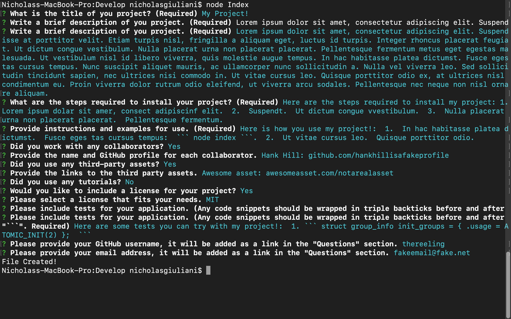
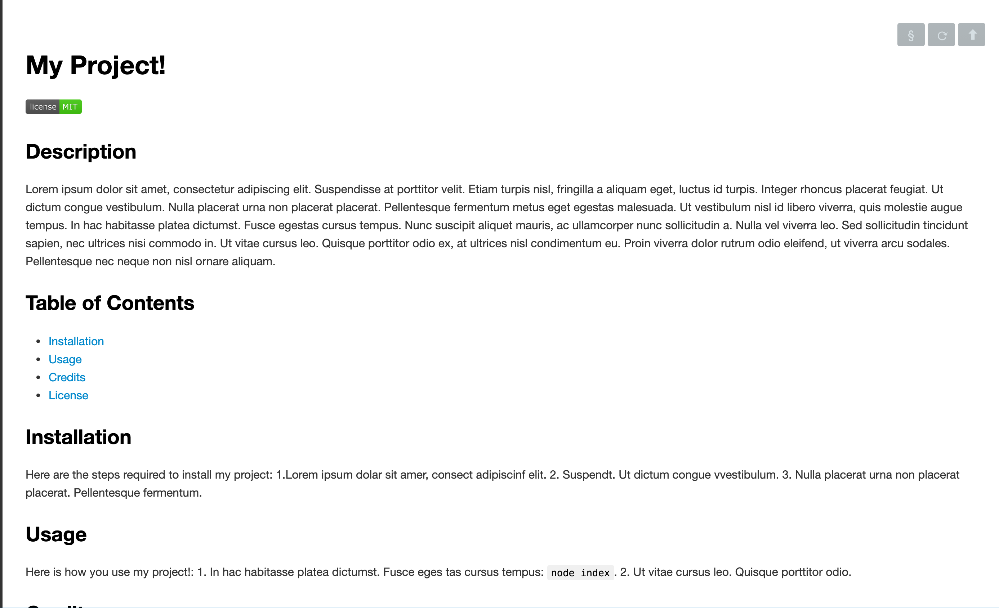

# Professional README Generator 

## Description 

This application is a README.md generator thats uses node.js and the inquirer NPM package to prompt the user for input, and then take that data and create a professional README.  Creating a well-written/organized README is crucial in software development, since it helps with communication and collaboration.  Using this application will help streamline and speed up the README creation process, giving the develop more time to code!  To use this application, please watch this quickstart guide: (Link to google drive containing video). 




 

## Table of Contents 

* [Installation](#installation)
* [Usage](#usage)
* [Credits](#credits)
* [License](#license)

## Installation 

To install this application, you must have node.js installed on your computer (https://nodejs.org/en/download/).  Once installed, follow these steps:  

1. At this projects GitHub Repo, click on the green code button and download the .ZIP file.

2. Extract the contents of the .ZIP file on you computer.


## Usage 

To use this application, follow these steps:  

1. Open the root dir with terminal, Git Bash, or any other terminal based CLI.  The root folder should be called 'README_generator'.

2. Move from the root dir to the develop dir using the command: ```cd Develop```

3. While in the develop dir, run the command: ```node index``` This will run the application.

4.  Once the app starts running, follow the prompts in the terminal.  Once finished a README file will be created in the develop dir.

5. Please reference the quickstart guide video for any more question!

## Credits 

Inquirer.js: https://www.npmjs.com/package/inquirer
Starter code: https://github.com/coding-boot-camp/potential-enigma

## License 

MIT License

Copyright (c) 2021 Nick Giuliani

Permission is hereby granted, free of charge, to any person obtaining a copy
of this software and associated documentation files (the "Software"), to deal
in the Software without restriction, including without limitation the rights
to use, copy, modify, merge, publish, distribute, sublicense, and/or sell
copies of the Software, and to permit persons to whom the Software is
furnished to do so, subject to the following conditions:

The above copyright notice and this permission notice shall be included in all
copies or substantial portions of the Software.

THE SOFTWARE IS PROVIDED "AS IS", WITHOUT WARRANTY OF ANY KIND, EXPRESS OR
IMPLIED, INCLUDING BUT NOT LIMITED TO THE WARRANTIES OF MERCHANTABILITY,
FITNESS FOR A PARTICULAR PURPOSE AND NONINFRINGEMENT. IN NO EVENT SHALL THE
AUTHORS OR COPYRIGHT HOLDERS BE LIABLE FOR ANY CLAIM, DAMAGES OR OTHER
LIABILITY, WHETHER IN AN ACTION OF CONTRACT, TORT OR OTHERWISE, ARISING FROM,
OUT OF OR IN CONNECTION WITH THE SOFTWARE OR THE USE OR OTHER DEALINGS IN THE
SOFTWARE.